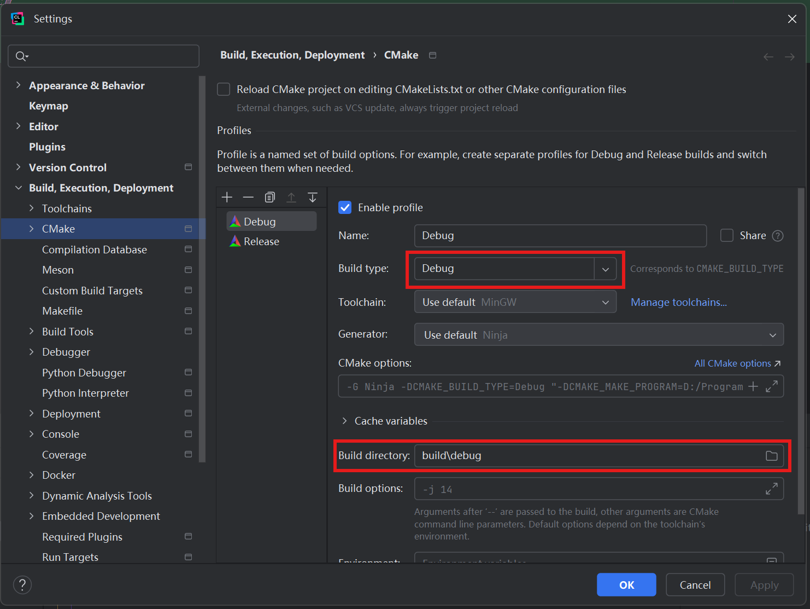
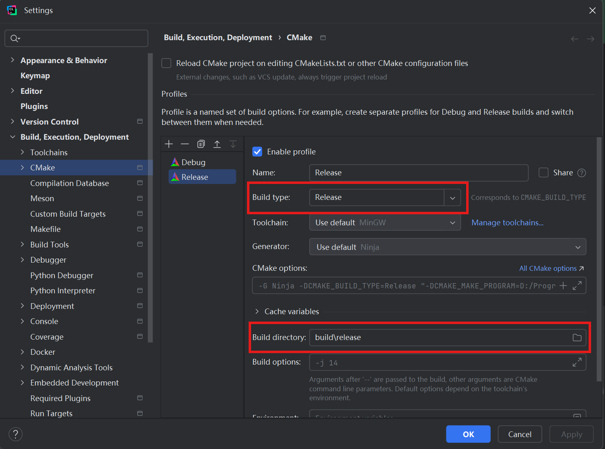

# CLion配置

## CMake Profiles配置

- 打开 **File | Settings | Build, Execution, Deployment | CMake**
- 将 **Build type** 的值更改为 `Debug`或`Release`
- 将 **Build directory** 的值更改为`./build/debug`或`./build/release`
  
  

## 保存时自动格式化

### 开启 clang-format

打开 **File | Settings | Editor | Code Style**，在 **ClangFormat** 勾选 **Enable ClangFormat(only for C/C++/Objective-C)
**

### 开启 Save Actions

- 打开 **File | Settings | Plugins**，在 **Marketplace** 中搜索并安装 **Save Actions X**
- 重启 IDE，转到 **File | **Setttings** | Save Actions**，勾选以下选项：
  